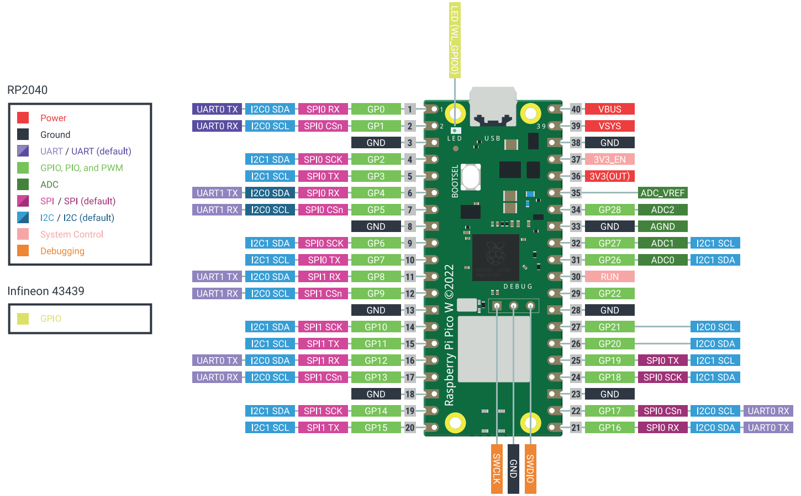

# MICROPYTHON ADC VIEWER

## project description

This is a viewer of the values sampled by the ADC.

The ADC reads an analog input, then the value is shown on the display.

This is the base building block for various measurement devices.

## Schematic

